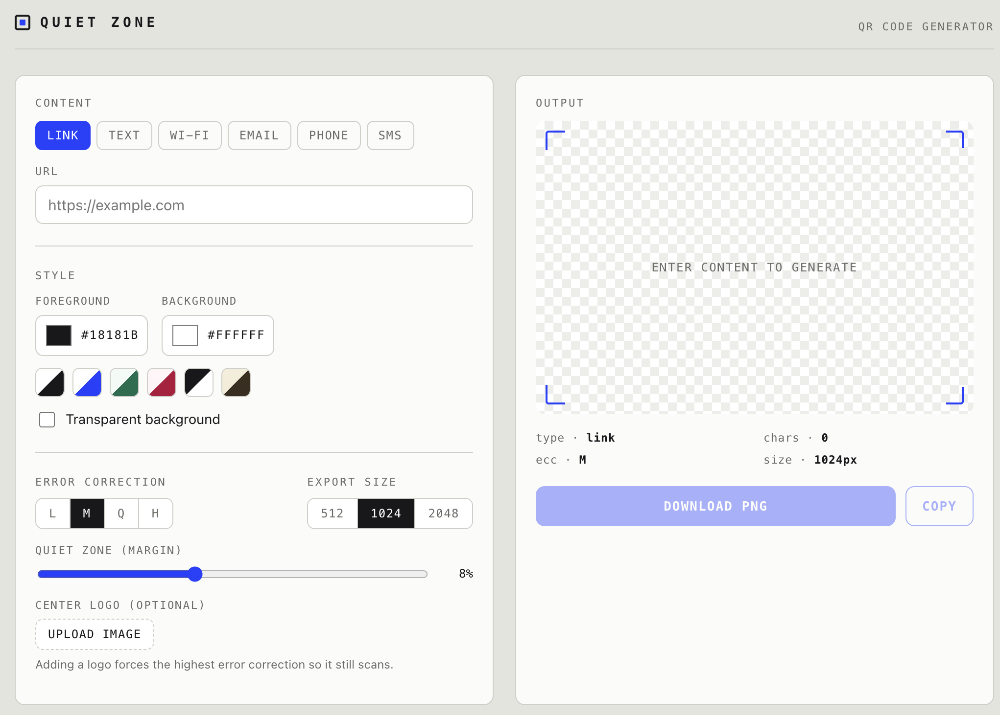

# QR Code Generator

A clean, single-file QR code generator that runs entirely in the browser. Type something in, style it, and download a scannable PNG — no install, no sign-up, no data ever leaves your device.

**Live demo:** https://Dec444.github.io/qr-generator/

> Replace the link above with your actual GitHub Pages URL once the site is deployed.

<!-- Add a screenshot to make the repo shine:
     1. Open the app and take a screenshot of it with a QR code generated.
     2. Save it in the repo as screenshot.png
     3. Uncomment the line below.
-->
<!--  -->

## Features

- **Six content types** — Link, plain Text, Wi-Fi, Email, Phone, and SMS, each encoded in the correct format so phones recognize them.
- **Wi-Fi sharing** — generates a code that joins a network on scan, with support for WPA/WEP/open and hidden networks.
- **Full styling** — custom foreground and background colors, six quick-pick presets, and a transparent-background option.
- **Print-ready output** — adjustable quiet-zone margin, selectable error-correction level (L/M/Q/H), and export sizes up to 2048 px.
- **Center logo** — drop your own image into the middle of the code; error correction is automatically raised so it still scans.
- **Export** — download as PNG or copy straight to the clipboard.
- **Private by design** — everything runs client-side, so the content you encode never gets sent anywhere.

## How to use it

### Online
Visit the live demo link above. That's it — it works on desktop and mobile.

### Locally
1. Download or clone this repository.
2. Open `index.html` in any modern browser (double-click it, or drag it into a browser window).

The app works offline after the first load. The only external dependency is the QR-encoding library, which is fetched from a CDN the first time you open the page.

## How it works

Quiet Zone is intentionally a single static HTML file with no build step and no framework. Under the hood:

- A small **state object** holds every setting (content type, colors, size, margin, logo). Any control change updates that object and re-runs a single `render()` function, so the preview is always rebuilt from the current settings.
- The chosen content is assembled into the appropriate **encoded string** (for example, a Wi-Fi code is just the text `WIFI:T:WPA;S:network;P:password;;`).
- That string is passed to **[qrcodejs](https://github.com/davidshimjs/qrcodejs)** to compute the module grid.
- The result is **composited onto an HTML `<canvas>`**, which adds the margin, applies transparency, overlays the optional logo, and produces the downloadable PNG.

## Tech stack

- HTML, CSS, and vanilla JavaScript — no frameworks, no build tools
- [qrcodejs](https://github.com/davidshimjs/qrcodejs) for QR encoding (loaded via cdnjs)
- The HTML Canvas API for compositing and export

## Project structure

```
.
├── index.html   # the entire app — markup, styles, and logic in one file
└── README.md
```

## Customization

The color palette lives in CSS variables at the top of the file, inside the `:root` block. Changing those values re-themes the whole app in a few lines — for example, swap the accent color:

```css
:root {
  --accent: #2440FF;   /* change this to re-theme buttons, focus rings, and accents */
}
```

## Deploying your own copy

Because it's a static site, it hosts anywhere that serves files. Two free options:

- **GitHub Pages** — push this repo, then go to **Settings → Pages**, set the source to the `main` branch and the root folder, and save. Your site appears at `https://YOUR-USERNAME.github.io/REPO-NAME/`.
- **Netlify Drop** — drag `index.html` onto [app.netlify.com/drop](https://app.netlify.com/drop) for an instant URL with no account.

> Tip: hosts serve `index.html` by default, so keep the main file named exactly that.

## License

Released under the MIT License — free to use, modify, and share. If you'd like to make this official, add a `LICENSE` file to the repo (GitHub can generate an MIT one for you when you create a new file named `LICENSE`).

## Acknowledgements

QR encoding is powered by [qrcodejs](https://github.com/davidshimjs/qrcodejs) by David Shim.
